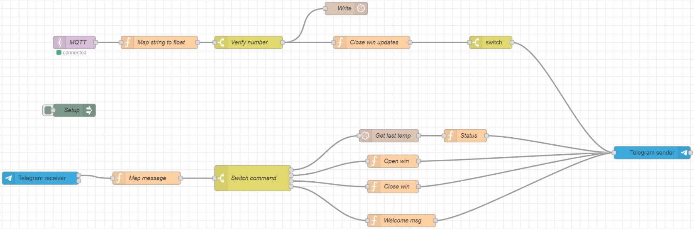

# temperature-monitor

This project is the final delivery for the IoT course. It includes an IoT system that monitors temperature and controls windows using MQTT, InfluxDB, Node-RED, and Grafana.

## Installation

1. Install Arduino IDE version 1.8.19.
2. Use the Mosquitto MQTT broker at `test.mosquitto.org`.

## Project Structure

- `central/central.ino`: Arduino code for the ESP32 client that connects to WiFi and publishes temperature data to the MQTT broker.
- `docker-compose.yml`: Docker Compose file to set up InfluxDB, Node-RED, and Grafana services.
- `node-red-data/`: Contains Node-RED flow configurations and settings.
- `grafana/`: Contains Grafana provisioning and data directories.
- `mosquitto/config/mosquitto.conf`: Configuration file for the Mosquitto MQTT broker.

## How to Run

1. Clone the repository:
    ```sh
    git clone https://github.com/cd-paliv/temperature-monitor
    cd temperature-monitor
    ```

2. Start the Docker services:
    ```sh
    docker-compose up -d
    ```

3. Upload the code in `central/central.ino` to your ESP32.

The ESP will connect to the WiFi and start publishing temperature data to the MQTT broker. The Node-RED flows will receive the data, store it in InfluxDB, and send a notification if the temperature is above a certain threshold.

## Node-RED Flows

The Node-RED flows are configured to:
- Receive temperature data from the MQTT broker.
- Map the values to the correct format and verify its integrity.
    - Store the data in InfluxDB.
    - Check if the temperature is above a certain threshold.
        - If it is, send a notification via Telegram.
- If a message is received, switch to define functionality:
    - **/estado**: Allows the user to obtain the current state, including the current temperature and window status.
    - **/abrir**: Allows the user to open the windows if the motor is not active or the windows are closed.
    - **/cerrar**: Allows the user to close the windows if the motor is not active or the windows are open.
    - If another message is sent, a welcome message is displayed with the available options.



## Grafana Dashboard

Grafana is used to visualize the temperature data stored in InfluxDB. The dashboard is pre-configured and can be accessed at `http://localhost:3000` with the default credentials (`admin`/`admin`).
